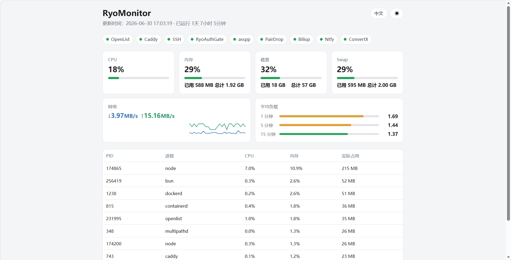
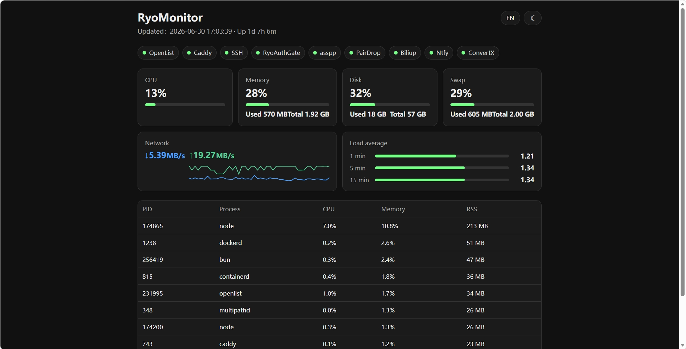
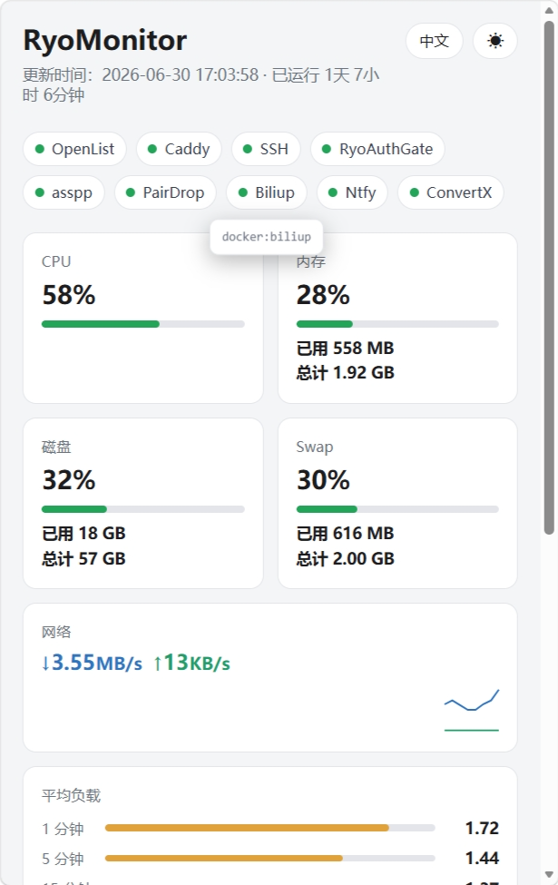
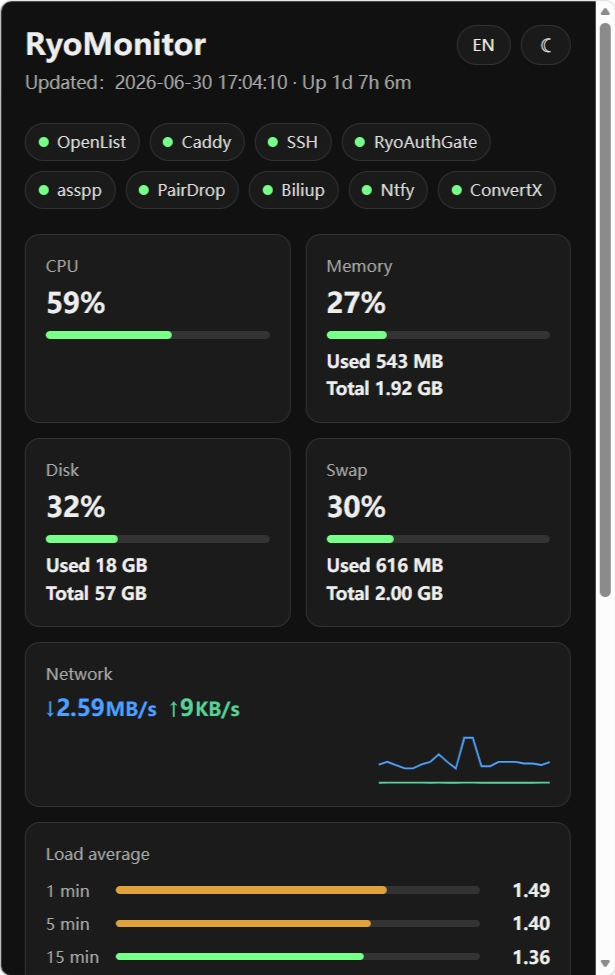

# RyoMonitor

<p align="center">
  
</p>

[English](README.md) | [简体中文](README.zh-CN.md)

RyoMonitor is a lightweight self-hosted VPS monitor with a light/dark dashboard, optional built-in password login or upstream SSO, and no frontend build step.

It is built for small servers where a full monitoring stack is more than you need.

<p align="center"><strong>Desktop</strong></p>
<p align="center">
  
  
</p>
<p align="center"><sub>Light · 中文 UI &nbsp;|&nbsp; Dark · English UI</sub></p>

<p align="center"><strong>Mobile</strong></p>
<p align="center">
  
  
</p>
<p align="center"><sub>Responsive layout on narrow screens</sub></p>

## Why RyoMonitor

- Single Go binary, standard library only, no runtime deps
- No database
- No frontend build step
- Single VPS deployment
- Built-in password protection, or upstream SSO (`trustproxy` build)
- Chinese and English web UI, with a light/dark theme toggle
- Installable to the iOS / Android home screen (PWA icons + web manifest)
- Git-based update workflow

## Footprint

```text
Binary: about 6.5 MB (`trustproxy` build) / about 6.6 MB (built-in login)
Runtime memory: about 8 MB RSS
status.json: served from memory, never written to disk
Database: none
Frontend build: none
```

## What It Shows

- CPU usage
- Memory and swap usage
- Disk usage
- Network throughput
- Load average
- Uptime
- Service status (systemd units and Docker containers)
- Top processes by memory usage

## How It Works

A single Go process tier-collects metrics into memory and serves the static dashboard plus `/status.json` over HTTP.

```text
ryo-monitor.service
  -> bin/ryo-monitor
       collection: core metrics 1s / top processes every 3s / services every 5s
       HTTP: dashboard + /status.json
```

**Two deployment modes (pick one):**

| Mode | Build | In front |
| --- | --- | --- |
| Built-in login | `scripts/build.sh` (default) | Caddy `reverse_proxy` → `127.0.0.1:8090` |
| Upstream SSO | `MON_AUTH_TRUST_PROXY=1` then `scripts/build.sh` | Caddy `forward_auth` + `reverse_proxy` (e.g. auth-gate) |

The default build embeds `login.html`. A `trustproxy` build strips auth code at compile time—use only when upstream already authenticates users.

## Files

```text
app/index.html                  Dashboard UI
app/assets/                     Logo, PWA icons, and manifest
cmd/ryo-monitor/main.go         Collector and HTTP server
cmd/ryo-monitor/auth_default.go Built-in login (default build)
cmd/ryo-monitor/auth_trustproxy.go  trustproxy build stubs (no login)
cmd/ryo-monitor/login.html      Login page (embedded in default build only)
bin/ryo-monitor                   Build output (git-ignored)
scripts/build.sh                Unified build (auto-selects trustproxy tag)
scripts/install.sh              First install
scripts/update.sh               Pull, rebuild, restart
systemd/ryo-monitor.service   systemd unit template
caddy/Caddyfile.example         Caddy reverse proxy example
.env.example                    Example environment variables
```

## Requirements

- Linux VPS with systemd
- Caddy
- Git, if you want GitHub-based updates
- Go 1.22+ to build the backend (installed locally, or build with the Docker `golang:1-alpine` image)

## Build

Prefer `scripts/build.sh` (local Go if available, otherwise Docker `golang:1-alpine`):

```bash
bash scripts/build.sh
```

If `/etc/ryo-monitor.env` contains `MON_AUTH_TRUST_PROXY=1`, the script adds `-tags trustproxy` automatically.

Manual examples:

```bash
# Built-in login (default)
CGO_ENABLED=0 go build -ldflags='-s -w' -o bin/ryo-monitor ./cmd/ryo-monitor

# Upstream SSO
CGO_ENABLED=0 go build -tags trustproxy -ldflags='-s -w' -o bin/ryo-monitor ./cmd/ryo-monitor
```

## Install

```bash
git clone https://github.com/RyoSXu/RyoMonitor.git /opt/ryo-monitor
cd /opt/ryo-monitor
bash scripts/build.sh
```

**Built-in login**: run the installer as root and set a password (written to `/etc/ryo-monitor.env`):

```bash
DOMAIN=mon.example.com bash scripts/install.sh
```

**Upstream SSO**: create `/etc/ryo-monitor.env` first (see `.env.example`), include at least `MON_AUTH_TRUST_PROXY=1` and collector settings, then build and enable the service:

```bash
cp .env.example /etc/ryo-monitor.env
# Edit /etc/ryo-monitor.env: enable MON_AUTH_TRUST_PROXY=1 and set RYO_MONITOR_*
chmod 600 /etc/ryo-monitor.env
bash scripts/build.sh
install -m 0644 systemd/ryo-monitor.service /etc/systemd/system/
systemctl daemon-reload && systemctl enable --now ryo-monitor
```

Do not commit `/etc/ryo-monitor.env`.

## Caddy

**Built-in login** (RyoMonitor validates the password):

```caddyfile
mon.example.com {
    reverse_proxy 127.0.0.1:8090
}
```

**Upstream SSO** (auth-gate or similar; RyoMonitor built with `trustproxy`):

```caddyfile
mon.example.com {
    import protected 127.0.0.1:8090
}
```

`protected` is a snippet from your SSO gateway (`forward_auth` + `/_auth/*`). See that gateway’s docs.

Validate and reload:

```bash
caddy validate --config /etc/caddy/Caddyfile
systemctl reload caddy
```

## Update

After pushing changes to GitHub, update the VPS with:

```bash
cd /opt/ryo-monitor
bash scripts/update.sh
```

The update script runs `git pull --ff-only`, rebuilds the Go binary, restarts the service, and checks the health endpoint.

## Configuration

All environment variables live in `/etc/ryo-monitor.env`. For built-in login, generate it with `bin/ryo-monitor genenv <password>` (the installer runs this automatically).

```text
/etc/ryo-monitor.env
```

Example:

```bash
MON_AUTH_HOST=127.0.0.1
MON_AUTH_PORT=8090
MON_AUTH_WEB_ROOT=/opt/ryo-monitor/app
MON_AUTH_SESSION_TTL=604800
MON_AUTH_PASSWORD_HASH=pbkdf2_sha256$260000$<salt>$<hash>
MON_AUTH_SECRET=<random>
RYO_MONITOR_IFACE=eth0
RYO_MONITOR_SERVICES="OpenList=openlist Caddy=caddy SSH=ssh"
```

| Variable | Purpose |
| --- | --- |
| `MON_AUTH_HOST` / `MON_AUTH_PORT` | Address the gateway binds to (keep on `127.0.0.1`). |
| `MON_AUTH_WEB_ROOT` | Directory served as the dashboard (`app/`). |
| `MON_AUTH_SESSION_TTL` | Login session lifetime in seconds. |
| `MON_AUTH_PASSWORD_HASH` / `MON_AUTH_SECRET` | Password hash and session secret for built-in login (not needed for `trustproxy` builds). |
| `MON_AUTH_TRUST_PROXY` | Set to `1` when upstream SSO handles auth; `scripts/build.sh` adds `-tags trustproxy` and strips built-in login. |
| `MON_AUTH_COOKIE` | Session cookie name (default `ryo_mon_session`). |
| `RYO_MONITOR_IFACE` | Network interface used for throughput. |
| `RYO_MONITOR_SERVICES` | Service pills to show (see below). |

### Trusting a Reverse Proxy / SSO

1. Set `MON_AUTH_TRUST_PROXY=1` in `/etc/ryo-monitor.env`
2. Run `bash scripts/build.sh` (adds `-tags trustproxy` automatically)
3. Configure Caddy `forward_auth` for the site (see Caddy section above)
4. `systemctl restart ryo-monitor`

Enable only when upstream access control is already in place. For standalone login, omit `MON_AUTH_TRUST_PROXY` and use the default build.

### Custom Service Checks

RyoMonitor checks systemd services by default. Configure the dashboard service pills with `RYO_MONITOR_SERVICES`:

```bash
RYO_MONITOR_SERVICES="Nginx=nginx Docker=docker PostgreSQL=postgresql"
```

Each item uses this format:

```text
DisplayName=systemd-unit-name
```

The display name is shown as-is in the dashboard. The unit name is passed to:

```bash
systemctl is-active <unit>
```

To monitor a **Docker container** instead of a systemd unit, prefix the name with `docker:`:

```bash
RYO_MONITOR_SERVICES="Caddy=caddy MyApp=docker:myapp"
```

`docker:<name>` is checked via the Docker socket (`/var/run/docker.sock`) and shown as active when the container is running.

## Security Notes

- Keep `/etc/ryo-monitor.env` out of Git.
- Bind the service to `127.0.0.1` and expose it only through Caddy HTTPS.
- **Built-in login**: protect `MON_AUTH_SECRET`; rotate passwords with `bin/ryo-monitor genenv <new-password>`, rewrite the env file, and restart.
- **Upstream SSO**: ensure Caddy `forward_auth` is enabled; RyoMonitor itself does not validate passwords.
