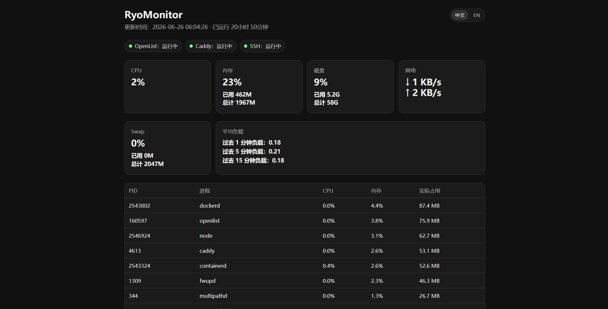

# RyoMonitor

<p align="center">
  
</p>

[English](README.md) | [简体中文](README.zh-CN.md)

RyoMonitor 是一个轻量的自托管 VPS 监控面板，带深色看板、密码登录，并且不需要前端构建步骤。

它适合小型服务器：当完整监控系统太重，但你又需要一个清晰、私有、容易同步的状态页时，RyoMonitor 正好够用。

<p align="center">
  
</p>

## 为什么是 RyoMonitor

- 单个 Go 二进制，纯标准库、无运行时依赖
- 不需要数据库
- 不需要前端构建
- 适合单台 VPS 部署
- 自带密码保护
- Web UI 支持中文和英文
- 支持 GitHub 同步更新

## 部署占用

RyoMonitor 刻意保持小体积。当前 VPS 部署的实测量级：

```text
二进制大小：约 6.4 MB
运行内存：约 12 MB RSS（单个 Go 进程：指标采集 + 鉴权网关 + 静态服务）
status.json：内存提供，不落盘
数据库：无
前端构建：无
```

## 展示内容

- CPU 使用率
- 内存和 Swap 使用率
- 磁盘使用率
- 网络吞吐
- 平均负载
- 服务状态
- 按内存占用排序的主要进程

## 工作方式

```text
ryo-monitor.service
  -> bin/ryo-monitor (单个 Go 二进制)
       后台 goroutine: 每秒采集指标到内存
       HTTP 服务: 密码登录 + 静态看板 + /status.json

Caddy
  -> HTTPS
  -> reverse_proxy 127.0.0.1:8090
```

> v2 起后端由 Go 重写：采集器与鉴权网关合并为单个二进制、单个 systemd 服务，
> 不再依赖 Python / Bash，status.json 直接从内存提供（不落盘）。

## 文件结构

```text
app/index.html              监控看板 UI
app/assets/logo.svg         项目 logo 和前端图标
cmd/ryo-monitor/main.go     后端：采集器 + 鉴权网关（Go）
cmd/ryo-monitor/login.html  登录页（编译进二进制）
bin/ryo-monitor             构建产物（不入库）
scripts/install.sh          首次安装脚本
scripts/update.sh           git pull + 重新构建 + 重启脚本
systemd/ryo-monitor.service systemd 服务模板
caddy/Caddyfile.example     Caddy 反代示例
docs/screenshot.png         看板截图
.env.example                环境变量示例
```

## 运行要求

- 使用 systemd 的 Linux VPS
- Caddy
- Git，用于 GitHub 同步更新
- 构建后端需要 Go 1.22+（本机安装，或用 Docker `golang:1-alpine` 构建，无需污染系统）

## 构建

本机有 Go：

```bash
CGO_ENABLED=0 go build -ldflags='-s -w' -o bin/ryo-monitor ./cmd/ryo-monitor
```

或用 Docker 构建（无需本机装 Go）：

```bash
docker run --rm -v "$PWD":/src -w /src golang:1-alpine \
  sh -c "CGO_ENABLED=0 go build -ldflags='-s -w' -o bin/ryo-monitor ./cmd/ryo-monitor"
```

## 安装

把仓库克隆到 `/opt/ryo-monitor`：

```bash
git clone https://github.com/RyoSXu/RyoMonitor.git /opt/ryo-monitor
cd /opt/ryo-monitor
```

用 root 执行安装脚本：

```bash
DOMAIN=mon.example.com bash scripts/install.sh
```

安装脚本会要求输入登录密码，并把密码哈希和随机签名密钥写入：

```text
/etc/ryo-monitor.env
```

不要把这个文件提交到 Git。

## Caddy

添加类似配置：

```caddyfile
mon.example.com {
    reverse_proxy 127.0.0.1:8090
}
```

然后校验并 reload：

```bash
caddy validate --config /etc/caddy/Caddyfile
systemctl reload caddy
```

## 更新

本地修改并推送到 GitHub 后，在 VPS 上执行：

```bash
cd /opt/ryo-monitor
bash scripts/update.sh
```

更新脚本会执行 `git pull --ff-only`，重新构建 Go 二进制，重启服务并检查健康状态。

## 配置

所有环境变量集中在一个文件（安装脚本会用 `bin/ryo-monitor genenv <密码>` 自动生成）：

```text
/etc/ryo-monitor.env
```

示例：

```bash
MON_AUTH_HOST=127.0.0.1
MON_AUTH_PORT=8090
MON_AUTH_WEB_ROOT=/opt/ryo-monitor/app
MON_AUTH_SESSION_TTL=604800
MON_AUTH_PASSWORD_HASH=pbkdf2_sha256$260000$<salt>$<hash>
MON_AUTH_SECRET=<random>
RYO_MONITOR_IFACE=eth0
RYO_MONITOR_SERVICES="OpenList=openlist Caddy=caddy SSH=ssh"
```

### 自定义服务监控

RyoMonitor 默认检查 systemd 服务。可以用 `RYO_MONITOR_SERVICES` 配置看板顶部的服务状态：

```bash
RYO_MONITOR_SERVICES="Nginx=nginx Docker=docker PostgreSQL=postgresql"
```

每一项格式是：

```text
展示名=systemd服务名
```

展示名会原样显示在看板里，服务名会传给：

```bash
systemctl is-active <unit>
```

## 安全建议

- 不要泄露 `MON_AUTH_SECRET`。
- 不要把 `/etc/ryo-monitor.env` 提交到 Git。
- 认证网关只绑定 `127.0.0.1`。
- 只通过 Caddy HTTPS 暴露监控面板。
- 如需轮换密码，重新生成 `/etc/ryo-monitor.env` 并重启 `ryo-monitor.service`。
