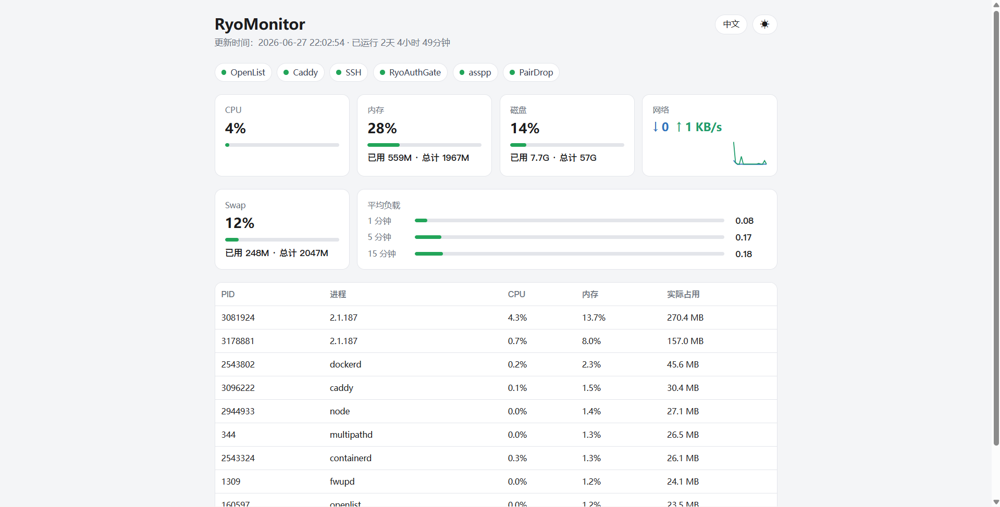
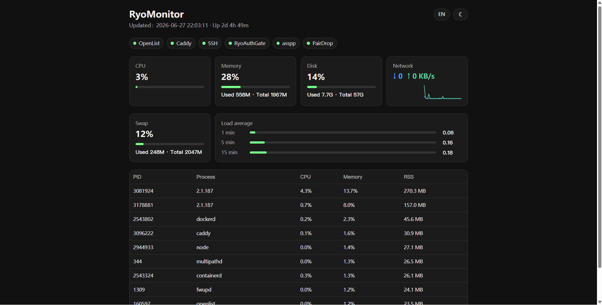

# RyoMonitor

<p align="center">
  
</p>

[English](README.md) | [简体中文](README.zh-CN.md)

RyoMonitor 是一个轻量的自托管 VPS 监控面板，支持明暗主题、可选内置密码登录或前置 SSO，无需前端构建。

它适合小型服务器：当完整监控系统太重，但你又需要一个清晰、私有、容易同步的状态页时，RyoMonitor 正好够用。

<p align="center">
  
  
</p>

## 为什么是 RyoMonitor

- 单个 Go 二进制，纯标准库、无运行时依赖
- 不需要数据库
- 不需要前端构建
- 适合单台 VPS 部署
- 内置密码保护，或前置 SSO（`trustproxy` 构建）
- Web UI 支持中文和英文，支持明暗主题切换
- 可添加到 iOS / 安卓主屏（PWA 图标 + web manifest）
- 支持 GitHub 同步更新

## 资源占用

```text
二进制：约 6.5 MB（trustproxy 构建）/ 约 6.6 MB（内置登录）
运行内存：约 8 MB RSS
status.json：内存提供，不落盘
数据库：无
前端构建：无
```

## 展示内容

- CPU 使用率
- 内存和 Swap 使用率
- 磁盘使用率
- 网络吞吐
- 平均负载
- 运行时间（Uptime）
- 服务状态（systemd 单元与 Docker 容器）
- 按内存占用排序的主要进程

## 工作方式

单进程 Go 服务：后台分层采集指标到内存，HTTP 提供静态看板与 `/status.json`。

```text
ryo-monitor.service
  -> bin/ryo-monitor
       采集：核心指标 1s / 进程 Top10 每 3s / 服务状态每 5s
       HTTP：看板 + /status.json
```

**两种部署方式（二选一）：**

| 方式 | 构建 | 前置 |
| --- | --- | --- |
| 内置登录 | `scripts/build.sh`（默认） | Caddy `reverse_proxy` → `127.0.0.1:8090` |
| 前置 SSO | `MON_AUTH_TRUST_PROXY=1` 后 `scripts/build.sh` | Caddy `forward_auth` + `reverse_proxy`（如 auth-gate） |

内置登录版在编译时嵌入 `login.html`；`trustproxy` 版编译期裁掉鉴权代码，仅在上游已鉴权时使用。

## 文件结构

```text
app/index.html                  监控看板 UI
app/assets/                     Logo、PWA 图标与 manifest
cmd/ryo-monitor/main.go         采集器与 HTTP 服务
cmd/ryo-monitor/auth_default.go 内置登录（默认构建）
cmd/ryo-monitor/auth_trustproxy.go  trustproxy 构建桩（无登录）
cmd/ryo-monitor/login.html        登录页（仅默认构建嵌入）
bin/ryo-monitor                   构建产物（不入库）
scripts/build.sh                统一构建（按 env 自动选择 trustproxy tag）
scripts/install.sh              首次安装
scripts/update.sh               拉取、构建、重启
systemd/ryo-monitor.service   systemd 模板
caddy/Caddyfile.example         Caddy 反代示例
.env.example                    环境变量示例
```

## 运行要求

- 使用 systemd 的 Linux VPS
- Caddy
- Git，用于 GitHub 同步更新
- 构建后端需要 Go 1.22+（本机安装，或用 Docker `golang:1-alpine` 构建，无需污染系统）

## 构建

推荐统一使用 `scripts/build.sh`（本机有 Go 则本地构建，否则自动用 Docker `golang:1-alpine`）：

```bash
bash scripts/build.sh
```

若 `/etc/ryo-monitor.env` 中已设 `MON_AUTH_TRUST_PROXY=1`，脚本会自动加 `-tags trustproxy`。

手动构建示例：

```bash
# 内置登录（默认）
CGO_ENABLED=0 go build -ldflags='-s -w' -o bin/ryo-monitor ./cmd/ryo-monitor

# 前置 SSO
CGO_ENABLED=0 go build -tags trustproxy -ldflags='-s -w' -o bin/ryo-monitor ./cmd/ryo-monitor
```

## 安装

```bash
git clone https://github.com/RyoSXu/RyoMonitor.git /opt/ryo-monitor
cd /opt/ryo-monitor
bash scripts/build.sh
```

**内置登录**：以 root 运行安装脚本，按提示设置密码（写入 `/etc/ryo-monitor.env`）：

```bash
DOMAIN=mon.example.com bash scripts/install.sh
```

**前置 SSO**：先创建 `/etc/ryo-monitor.env`（可参考 `.env.example`），至少包含 `MON_AUTH_TRUST_PROXY=1` 与采集项，再构建并启用服务：

```bash
cp .env.example /etc/ryo-monitor.env
# 编辑 /etc/ryo-monitor.env，取消 MON_AUTH_TRUST_PROXY=1 的注释并填写 RYO_MONITOR_* 
chmod 600 /etc/ryo-monitor.env
bash scripts/build.sh
install -m 0644 systemd/ryo-monitor.service /etc/systemd/system/
systemctl daemon-reload && systemctl enable --now ryo-monitor
```

不要把 `/etc/ryo-monitor.env` 提交到 Git。

## Caddy

**内置登录**（RyoMonitor 自行校验密码）：

```caddyfile
mon.example.com {
    reverse_proxy 127.0.0.1:8090
}
```

**前置 SSO**（由 auth-gate 等统一网关鉴权，RyoMonitor 使用 `trustproxy` 构建）：

```caddyfile
mon.example.com {
    import protected 127.0.0.1:8090
}
```

`protected` 为网关提供的 snippet（`forward_auth` + `/_auth/*`）。详见你的 SSO 网关文档。

校验并 reload：

```bash
caddy validate --config /etc/caddy/Caddyfile
systemctl reload caddy
```

## 更新

本地修改并推送到 GitHub 后，在 VPS 上执行：

```bash
cd /opt/ryo-monitor
bash scripts/update.sh
```

更新脚本会执行 `git pull --ff-only`，重新构建 Go 二进制，重启服务并检查健康状态。

## 配置

所有环境变量写在 `/etc/ryo-monitor.env`。内置登录可用 `bin/ryo-monitor genenv <密码>` 生成（安装脚本会自动调用）。

```text
/etc/ryo-monitor.env
```

示例：

```bash
MON_AUTH_HOST=127.0.0.1
MON_AUTH_PORT=8090
MON_AUTH_WEB_ROOT=/opt/ryo-monitor/app
MON_AUTH_SESSION_TTL=604800
MON_AUTH_PASSWORD_HASH=pbkdf2_sha256$260000$<salt>$<hash>
MON_AUTH_SECRET=<random>
RYO_MONITOR_IFACE=eth0
RYO_MONITOR_SERVICES="OpenList=openlist Caddy=caddy SSH=ssh"
```

| 变量 | 作用 |
| --- | --- |
| `MON_AUTH_HOST` / `MON_AUTH_PORT` | 网关绑定地址（保持 `127.0.0.1`）。 |
| `MON_AUTH_WEB_ROOT` | 作为看板提供的目录（`app/`）。 |
| `MON_AUTH_SESSION_TTL` | 登录会话有效期（秒）。 |
| `MON_AUTH_PASSWORD_HASH` / `MON_AUTH_SECRET` | 内置登录的密码哈希与会话密钥（`trustproxy` 构建不需要）。 |
| `MON_AUTH_TRUST_PROXY` | 置 `1` 表示由前置反代/SSO 鉴权；`scripts/build.sh` 会加 `-tags trustproxy` 裁掉内置登录。 |
| `MON_AUTH_COOKIE` | 会话 Cookie 名（默认 `ryo_mon_session`）。 |
| `RYO_MONITOR_IFACE` | 用于统计吞吐的网卡。 |
| `RYO_MONITOR_SERVICES` | 看板展示的服务项（见下文）。 |

### 信任前置反代 / SSO

1. `/etc/ryo-monitor.env` 设置 `MON_AUTH_TRUST_PROXY=1`
2. `bash scripts/build.sh`（自动 `-tags trustproxy`）
3. Caddy 对该站点使用 `forward_auth`（见上文 Caddy 节）
4. `systemctl restart ryo-monitor`

仅在上游已限制访问时启用。需要自带登录时，不要设 `MON_AUTH_TRUST_PROXY`，用默认构建即可。

### 自定义服务监控

RyoMonitor 默认检查 systemd 服务。可以用 `RYO_MONITOR_SERVICES` 配置看板顶部的服务状态：

```bash
RYO_MONITOR_SERVICES="Nginx=nginx Docker=docker PostgreSQL=postgresql"
```

每一项格式是：

```text
展示名=systemd服务名
```

展示名会原样显示在看板里，服务名会传给：

```bash
systemctl is-active <unit>
```

要监控 **Docker 容器**（而非 systemd 单元），给名字加 `docker:` 前缀：

```bash
RYO_MONITOR_SERVICES="Caddy=caddy MyApp=docker:myapp"
```

`docker:<名称>` 通过 Docker 套接字（`/var/run/docker.sock`）探测，容器运行时显示为在线。

## 安全建议

- 不要把 `/etc/ryo-monitor.env` 提交到 Git。
- 服务只绑定 `127.0.0.1`，经 Caddy HTTPS 对外暴露。
- **内置登录**：保管好 `MON_AUTH_SECRET`；轮换密码用 `bin/ryo-monitor genenv <新密码>` 更新 env 并重启。
- **前置 SSO**：确保 Caddy `forward_auth` 已启用；RyoMonitor 本身不再校验密码。
